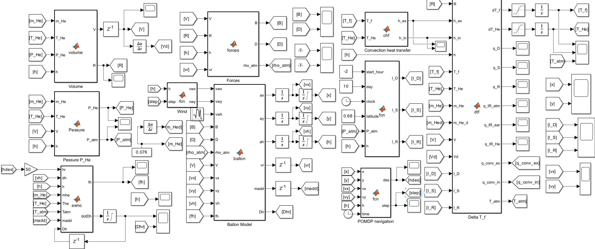
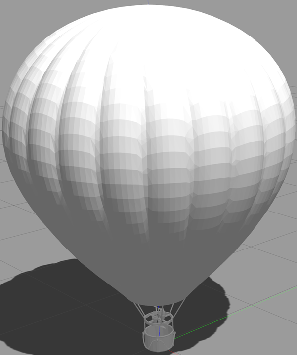
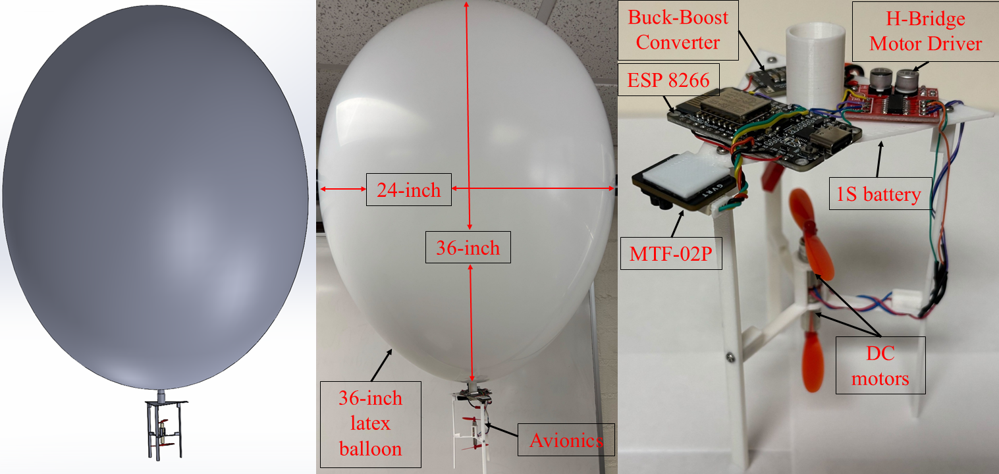
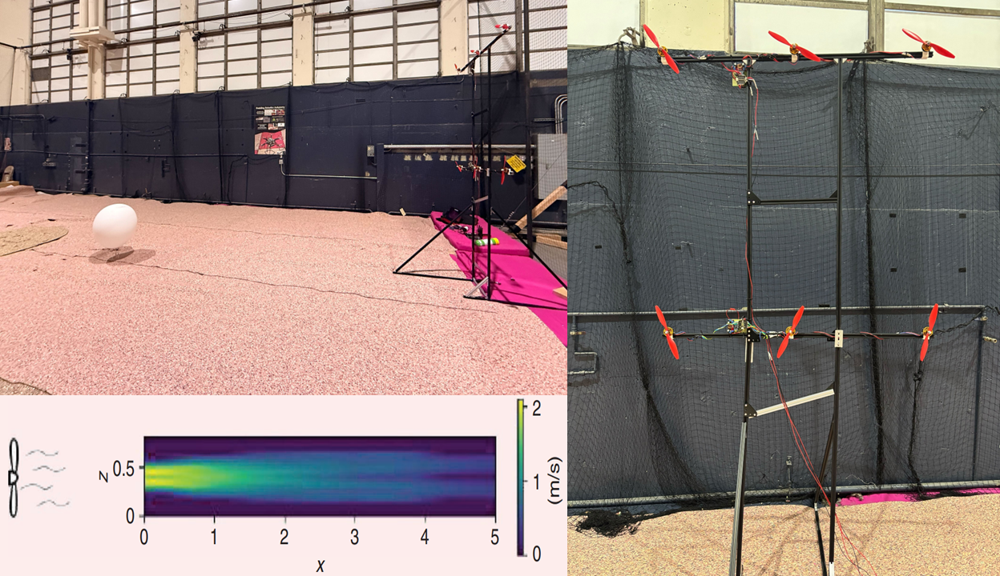

<div align="center">
    <h2>Autonomous Balloon: Autonomous Balloon based Adaptive Sliding Mode Control and Infinite-Horizon POMDP</h2>
</div>

# Highlights

This project provides a simulation platform for super-pressure balloons, featuring both a Simulink/MATLAB-based simulation and a quasi-physical model implemented in Gazebo/ROS 2. The experiments are conducted on a real platform weighing 75 grams, which is capable of tracking the desired altitude, estimating wind conditions, and making autonomous decisions.

# Simulations
We present results obtained from both Simulink/MATLAB and Gazebo/ROS 2 simulations, using parameters based on a real balloon to evaluate the effectiveness of the proposed method. The results are divided into two parts: (1) tracking the desired altitude, and (2) an autonomous balloon that estimates wind conditions and makes decisions to maintain a specific position.

# Simulink/Matlab
The diagram of the simulation in MATLAB/Simulink is presented as follows:

<p align="center">
  
</p>

The simulation files are located in the BalloonMatlab folder. The SPballoonASMC.slx file is used for tracking the desired altitude, while the SPballoonASMCPOMDPfull.slx file is for simulating the autonomous balloon.

## Gazebo/ROS 2
The visual model of the balloon in Gazebo is shown below:
<p align="center">
  
</p>


The simulation on Gazebo/ROS 2 running on the following software setup: 
- Ubuntu 22.04 + ROS2 Humble
- Gazebo 11
- Xarco-ROS-Humble (sudo apt install ros-humble-xacro)
- Gazebo_ros_pkgs (sudo apt install ros-humble-gazebo-ros-pkgs)


To set up the simulation on Gazebo/ROS 2 :

```shell
# Step 1: Create and build a colcon workspace:
$ mkdir -p ~/ros2_ws/src
$ cd ~/ros2_ws/
$ colcon build
$ echo "source ~/ros2_ws/devel/setup.bash" >> ~/.bashrc

# Step 2: Download the source file smcpomdpballoon  on the folder BalloonGazebo into your workspace
$ cd ~/ros2_ws/src

# Step 3: Build the colcon workspace for this package
$ cd ~/ros2_ws
$ colcon build
```

* Note that this project uses a custom plugin. Users need to replace the plugin path in the file /urdf/smcpomdpballoon.urdf.xacro at line 216. Replace: filename="/home/vanchung/dev_ws/install/smcpomdpballoon/lib/smcpomdpballoon/libsmcpomdpballoonplugin.so" with the correct path by changing the username to the name of your computer. Then rebuild the project again to run the simulation.
  
To run the simulation on Gazebo/ROS 2 :

```shell
# Step 1: Run the workspace:
$ ros2 launch smcpomdpballoon model.launch.py

# Step 2: Run the controller for the altitude holding or station keeping
$ ros2 run smcpomdpballoon altitudeholding
$ ros2 run smcpomdpballoon stationkeeping

```

# Experiments
## Design and Hardware Setup
The balloon is designed in SolidWorks, and all parts are 3D-printed. A 36-inch latex balloon is used in the project. The visual design in SolidWorks and the hardware setup are shown in the following figure: 

<p align="center">
  
</p>

The SolidWorks assembly and all the parts used can be found in the Balloon folder. 

The control board is powered by an ESP8266 module, which communicates with the ground station via the TCP protocol. For the indoor prototype, the balloon’s position is measured using the MTF-02P Optical & Range Sensor. All components are carried by a 36-inch latex balloon, with a total system weight of 75 grams. <br> 

For the setup of the station-keeping experiment, refer to the following figure:

<p align="center">
  
</p>

## Software Setup
This guide explains how to set up communication between an ESP8266 microcontroller and a ROS2 system using the TCP protocol. The source code is located in the Balloonexperiment folder.

```shell
# Step 1: Create and build a colcon workspace:
$ mkdir -p ~/ros2_ws/src
$ cd ~/ros2_ws/
$ colcon build
$ echo "source ~/ros2_ws/devel/setup.bash" >> ~/.bashrc

# Step 2: Download the source file esp8266server  on the folder Balloonexperiment into your workspace
$ cd ~/ros2_ws/src

# Step 3: Build the colcon workspace for this package
$ cd ~/ros2_ws
$ colcon build
```
To enable communication, the ESP8266 and the PC running ROS2 must be connected to the same Wi-Fi network. Upload the Arduino sketch pomdpballoonesp8266.ino into the ESP 8266, with the corrected IP address of the ROS2 host in line 14. After uploading the code to the ESP8266, run the following command to start the ROS2 TCP server:


```shell
ros2 run esp8266server server
ros2 topic pub /cmdvel std_msgs/msg/Float64MultiArray "data: [1, 0, 0]"
```


